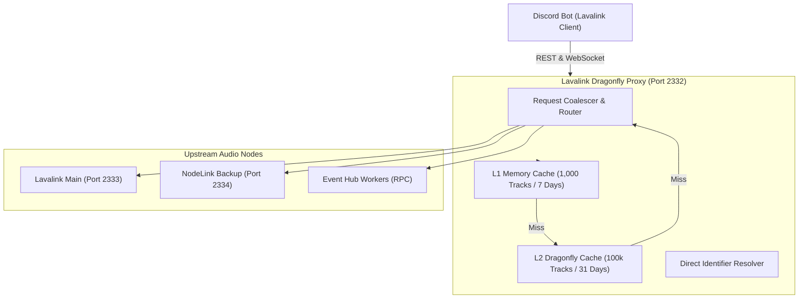

# Lavalink Dragonfly Proxy — Documentation Hub

Welcome to the comprehensive technical documentation for **Lavalink Dragonfly Proxy Source Routing**.

This proxy sits transparently between Discord music bots (such as `lavalink-client`, `shoukaku`, `kazagumo`, `poru`, etc.) and backend Lavalink / NodeLink audio nodes, providing **multi-tier caching**, **request coalescing**, **direct identifier playback**, **source routing**, and **circuit breaker fault tolerance**.

---

## 📚 Documentation Index

| Document | Description |
| :--- | :--- |
| [Architecture Overview](architecture.md) | High-level system topology, lifecycle, and component interactions. |
| [Caching & Performance](caching-and-performance.md) | L1 In-Memory & L2 Dragonfly caching, LRU eviction, and fuzzy search. |
| [Direct Playback & Resolving](direct-playback-and-resolving.md) | Zero-latency playback via `track.identifier` interception and speculative queue prefetching. |
| [Routing & Fallback Cascades](routing-and-fallbacks.md) | Source rewriting, multi-stage fallback cascades, and route learning (`LearnedRoute`). |
| [API Reference](api-reference.md) | Endpoints specification, proxy extensions, headers, and WebSocket handling. |
| [Configuration Guide](configuration.md) | Complete reference for `.env`, `config.ts`, thresholds, and security tokens. |
| [System Diagrams](diagrams.md) | Mermaid visual diagrams for data flow, cache states, and fault tolerance. |

---

## 🚀 Key Highlights & Capabilities

1. **Multi-Tier Caching Architecture**:
   - **L1 In-Memory LRU Cache**: Up to 1,000 hot tracks stored locally for up to 7 days (< 0.5ms access time).
   - **L2 Dragonfly In-Memory Database**: Up to 100,000 tracks stored in Dragonfly for 31 days (~1ms access time).
   - **Request Coalescing**: Collapses concurrent identical requests into a single upstream call.

2. **Direct Identifier Playback (`PATCH /v4/sessions/.../players/...`)**:
   - Enables bots to send direct search queries or Spotify/Deezer/ISRC identifiers directly to the player.
   - The proxy intercepts, resolves, caches, and injects playable audio tracks on the fly.

3. **Speculative Queue Lookahead & Batch Prefetch**:
   - Background pre-resolving endpoint (`POST /proxy/cache/prefetch` and `/v4/loadtracks/prefetch`) for instant track transitions.

4. **Dynamic Source Routing & Cascade Fallbacks**:
   - URL cleaning, ISRC normalization, regex-based source remapping (e.g. Spotify -> Deezer -> YouTube -> SoundCloud).
   - Route learning saves fastest working upstream paths and bypasses cascade retries on future plays.
