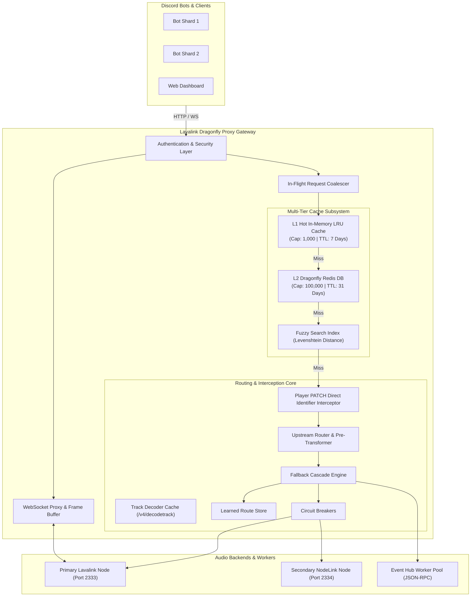

# System Architecture

The **Lavalink Dragonfly Proxy** is a high-performance audio routing and caching gateway built using **Bun** and **TypeScript**. It conforms to the **Lavalink v4 REST and WebSocket specifications**, acting as a drop-in replacement endpoint for Discord music bots.

---

## 🏗️ High-Level Topology

---

## 🧩 Core Architectural Components

### 1. HTTP Proxy Handler (`HttpProxyHandler`)
Located in `src/proxy/httpProxy.ts`. Handles incoming HTTP requests:
- **Authentication**: Validates standard Lavalink `Authorization` headers.
- **Monitoring & Stats**: Exposes `/proxy/health`, `/proxy/stats`, `/proxy/monitoring`.
- **Loadtracks Interception**: Handles `GET /v4/loadtracks` with multi-tier cache lookup and request deduplication.
- **Player Update Interception**: Intercepts `PATCH /v4/sessions/:sessionId/players/:guildId` to enable direct identifier playback.
- **Track Decoding**: Caches `/v4/decodetrack` and batch-decodes `/v4/decodetracks`.
- **Prefetching**: Asynchronously warms cache via `/proxy/cache/prefetch`.

### 2. Request Coalescing Engine
When multiple Discord guilds or users request the exact same search query or trending song simultaneously:
- Only **one** upstream request is dispatched.
- All concurrent listeners subscribe to the same active promise.
- Eliminates upstream hammering and 429 rate-limiting from YouTube/Spotify/Deezer scrapers.

### 3. Upstream Router & Cascading Fallback Engine (`UpstreamRouter`)
Located in `src/routing/index.ts`:
- **Pre-Request Phase**: Cleans URL tracking parameters (`utm_*`, `si=*`), normalizes ISRCs, and applies prefix rewrites.
- **Cascade Fallback Phase**: If an upstream node fails (HTTP error, empty search results, or rate limit), the cascade tries fallback rules sequentially up to `MAX_RECURSION_DEPTH`.
- **Route Learning**: Saves the successful upstream route (`LearnedRoute`) into Dragonfly for 30 minutes, allowing subsequent requests for the same query to execute in a single hop.

### 4. Circuit Breakers
Tracks failure counts per upstream node:
- Trips open after `failureThreshold` consecutive errors (default: 5).
- Rejects requests during `circuitBreakerResetMs` (default: 15s) with HTTP 503 instead of hanging on timeouts.
- Automatically executes half-open probes to recover healthy nodes.

### 5. WebSocket Proxy (`WsProxyHandler`)
Located in `src/proxy/wsProxy.ts`:
- Seamlessly proxies raw Lavalink v4 WebSocket voice connection messages (`ready`, `playerUpdate`, `event`, etc.).
- Protects clients from abrupt disconnects and sanitizes WebSocket close codes.
