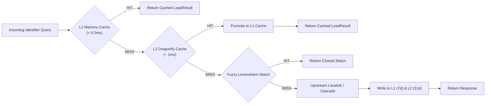

# Multi-Tier Caching & Performance

The proxy features an optimized two-tier caching architecture designed for high-concurrency Discord music bots.

---

## 🗄️ Cache Tier Hierarchy

### 1. Tier 1: Local In-Memory LRU Cache
- **Storage**: Process RAM (Node.js/Bun `Map` with LRU eviction).
- **Capacity**: Maximum **1,000 tracks** (`MEMORY_CACHE_MAX_ENTRIES=1000`).
- **Lifespan (TTL)**: **7 days** (`MEMORY_CACHE_TTL=604800` seconds).
- **Latency**: Sub-millisecond (`< 0.5ms`).
- **Eviction Strategy**: True Least-Recently-Used (LRU). When an entry is accessed or added, it moves to the front of the map. When size exceeds 1,000, oldest entries are evicted immediately.

### 2. Tier 2: Dragonfly In-Memory Database
- **Storage**: Dragonfly Redis-compatible in-memory store (`ioredis`).
- **Capacity**: Maximum **100,000 tracks** (`MAX_CACHED_ENTRIES=100000`).
- **Lifespan (TTL)**: **31 days** (`TRACK_TTL=2678400` & `SEARCH_TTL=2678400`).
- **Latency**: 1ms – 2ms.
- **LRU Management**: Managed using a Redis Sorted Set (`__lru_index`). Excess entries beyond 100k are periodically pruned via `ZPOPMIN` and `UNLINK`.

---

## 🔑 Cache Key Canonicalization

To avoid duplicate entries for identical songs requested via different formats, the proxy applies canonicalization rules:

1. **Direct Spotify Identifiers**:
   - `spotify:track:4cOdK2wGLETKBW3PvgPWqT` and `https://open.spotify.com/track/4cOdK2wGLETKBW3PvgPWqT?si=xyz` map to the exact same canonical key:
     `spotify:track:4cOdK2wGLETKBW3PvgPWqT`.
2. **Search Queries**:
   - Query string is unicode-normalized (NFKC), lowercased, and stripped of punctuation while preserving source prefixes (`ytsearch:`, `dzsearch:`, `scsearch:`).
   - E.g. `ytsearch:  Ed   Sheeran - Shape of You!! ` -> `ytsearch:ed sheeran shape of you`.
3. **Encoding Scope Isolation**:
   - Keys are hashed with sha256 including the upstream node's `encodingScope` (e.g. `lavalink-main` vs `nodelink`) to ensure that encoded track bytes from one node format never conflict with an incompatible node.

---

## 🔍 Fuzzy Search Optimization

When `FUZZY_SEARCH_ENABLED=true`:
- The proxy maintains an in-memory index of recent search queries.
- If a user inputs a slight typo (e.g. `"shpe of you"` instead of `"shape of you"`), the proxy computes the **Levenshtein Distance Similarity**.
- If similarity exceeds `FUZZY_SEARCH_THRESHOLD` (default: `0.9`), the proxy returns the cached track result instantly without making an external search request.

---

## ⚡ Track Decode Caching (`/v4/decodetrack`)

Decoding base64 Lavalink tracks takes CPU cycles on the bot or Lavalink node:
- **`GET /v4/decodetrack?encodedTrack=...`**: Caches decoded `LavalinkTrackInfo` in L1/L2 cache.
- **`POST /v4/decodetracks`**: Performs a multi-lookup in cache, only requesting cache misses from the upstream backend, merging results seamlessly.
