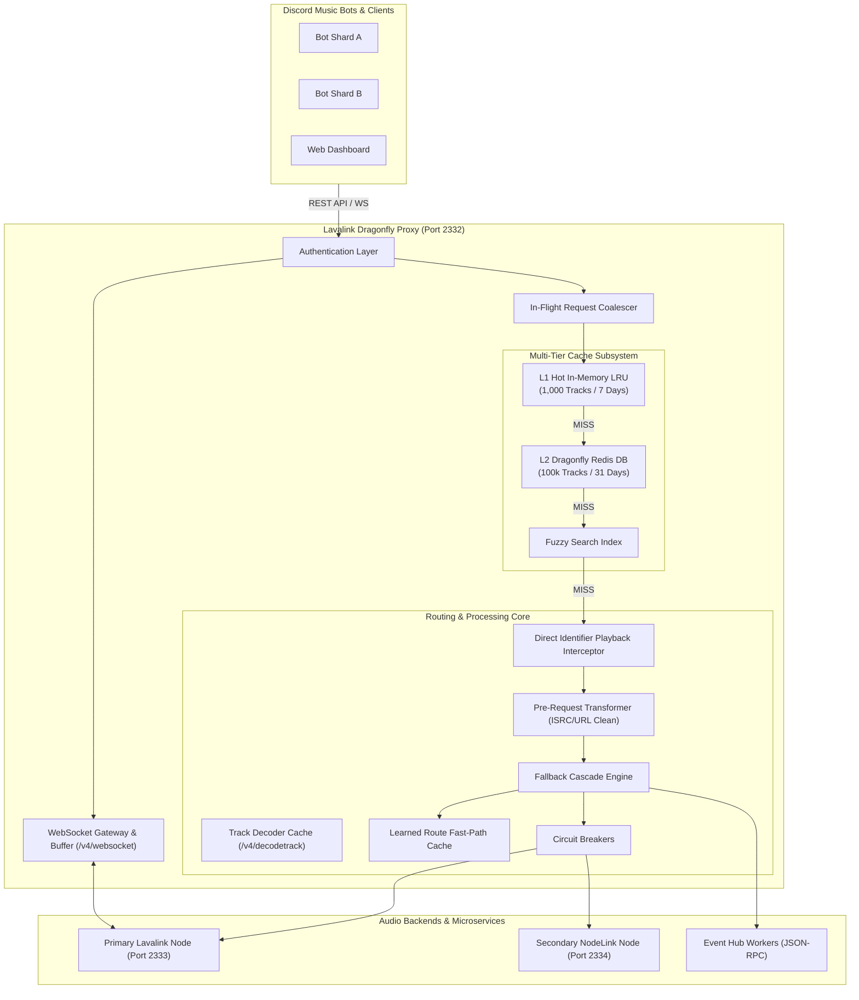
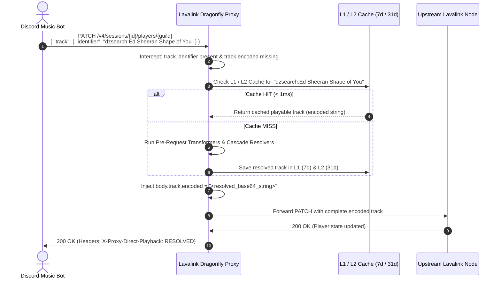
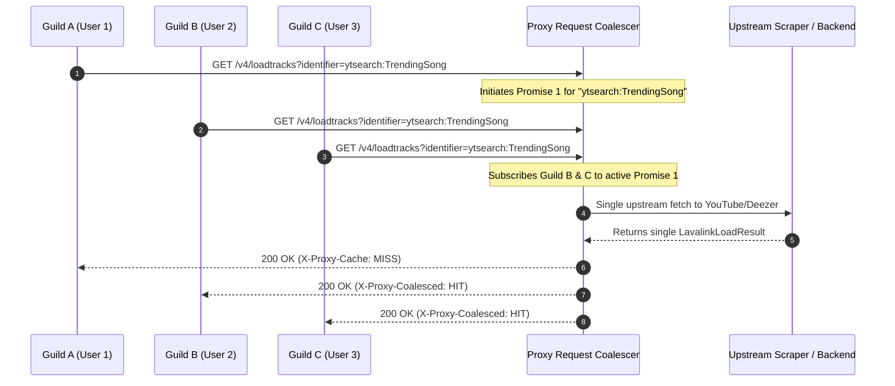
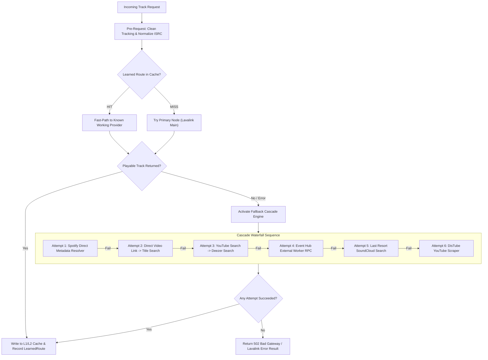
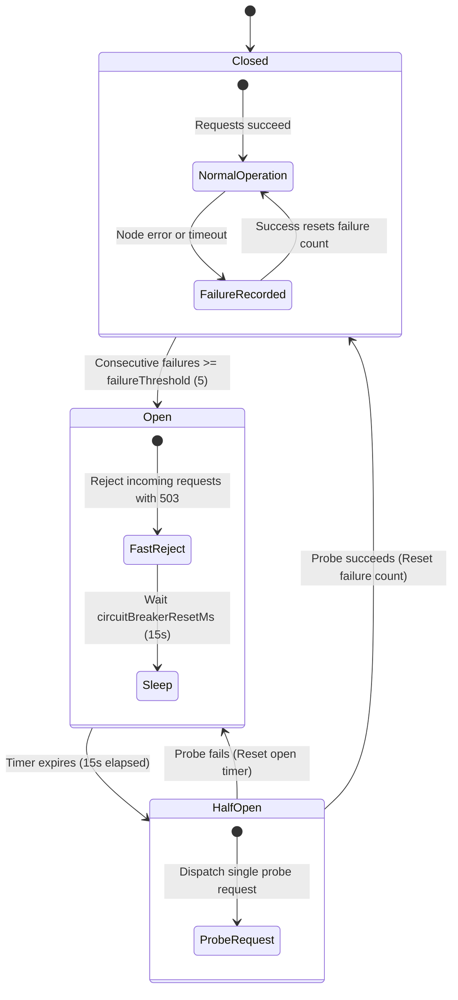

# System Visualizations & Diagrams

This document contains Mermaid diagrams illustrating data flow, caching hierarchies, direct playback mechanics, and fault tolerance workflows within the proxy.

---

## 1. Overall System Architecture

---

## 2. Direct Identifier Playback Flow (`PATCH /v4/sessions/:id/players/:guild`)

---

## 3. Request Coalescing Under High Concurrency

---

## 4. Multi-Stage Fallback Cascade Decision Tree

---

## 5. Circuit Breaker State Machine

