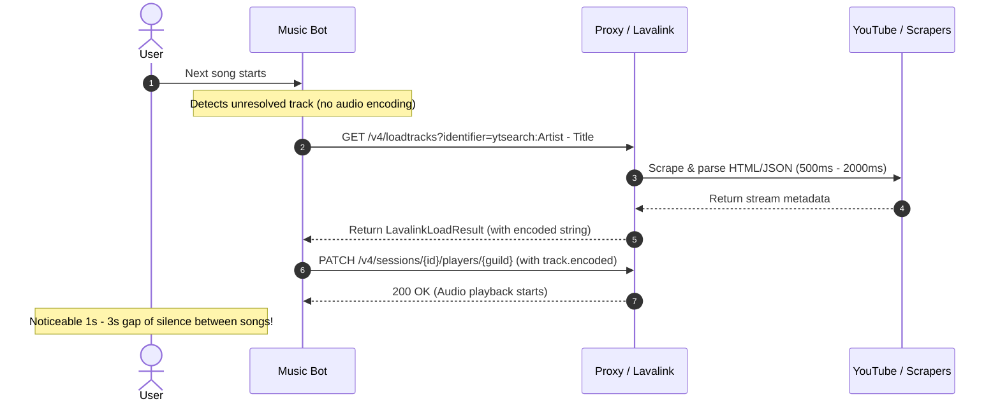
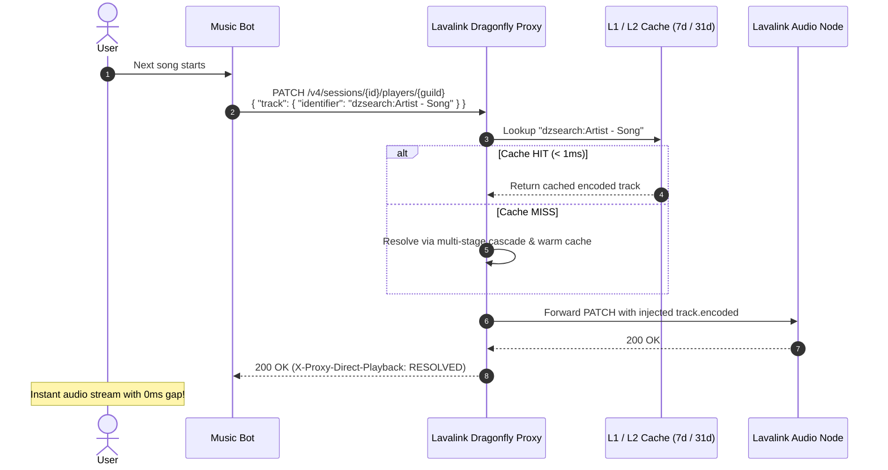

# Direct Playback & Resolving Optimization

Resolving unresolved tracks (Spotify URLs, Apple Music tracks, ISRC queries, or search queries) before playback is traditionally one of the biggest sources of latency in Discord music bots.

This document describes how the proxy eliminates this bottleneck through **Direct Identifier Playback** and **Speculative Queue Lookahead**.

---

## 🛑 The Traditional Bottleneck vs. Direct Interception

### Traditional Flow (Synchronous & Blocking)


---

### Optimized Flow: Direct Identifier Playback & Cache


---

## 🎯 Direct Identifier Playback Implementation

When a Discord bot sends a player update `PATCH /v4/sessions/:sessionId/players/:guildId`:
```json
{
  "track": {
    "identifier": "https://open.spotify.com/track/4cOdK2wGLETKBW3PvgPWqT",
    "userData": {
      "requester": "123456789012345678"
    }
  },
  "volume": 100
}
```

The proxy executes the following sequence:
1. Detects `track.identifier` is present while `track.encoded` is omitted/empty.
2. Resolves the identifier via the internal coalesced load pipeline (`handleCoalescedLoad`):
   - Checks **L1 Memory Cache** (< 0.5ms).
   - Checks **L2 Dragonfly Cache** (1ms).
   - If not cached, executes the pre-request transformer and fallback cascade, caches the result for 31 days in Dragonfly & 7 days in Memory, and saves the learned route.
3. Injects the resolved playable `encoded` base64 string into `body.track.encoded`.
4. Forwards the rewritten request to the upstream Lavalink node.
5. Injects response headers:
   - `X-Proxy-Direct-Playback: RESOLVED`
   - `X-Proxy-Cache: HIT` (or `MISS`)

---

## 🔮 Speculative Queue Lookahead (Prefetching)

To completely eliminate any chance of a cache miss when a song starts:

### Bot Implementation Pattern
While track $N$ is currently playing in voice channel:
```typescript
// Background lookahead worker: Warm up the next track in queue
async function warmupNextTrack(nextTrackIdentifier: string) {
    await fetch(`http://127.0.0.1:2332/proxy/cache/prefetch`, {
        method: "POST",
        headers: {
            "Authorization": "M!v4tor2026",
            "Content-Type": "application/json"
        },
        body: JSON.stringify({
            identifiers: [nextTrackIdentifier]
        })
    });
}
```

### Prefetch Endpoint Specification
- **Endpoint**: `POST /proxy/cache/prefetch` or `POST /v4/loadtracks/prefetch`
- **Request Body**:
  ```json
  {
    "identifiers": [
      "https://open.spotify.com/track/4cOdK2wGLETKBW3PvgPWqT",
      "dzsearch:Coldplay - Yellow",
      "isrc:GBAYE0000047"
    ]
  }
  ```
- **Response**:
  ```json
  {
    "status": "ok",
    "prefetched": 3,
    "results": [
      { "identifier": "...", "status": "ok", "loadType": "track", "cached": true },
      { "identifier": "...", "status": "ok", "loadType": "search", "cached": false },
      { "identifier": "...", "status": "ok", "loadType": "track", "cached": true }
    ]
  }
  ```
