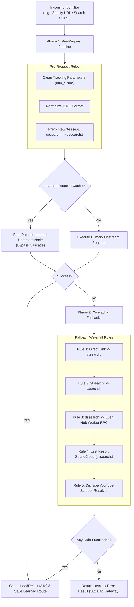

# Source Routing & Fallback Cascades

The proxy features a declarative **Source Routing & Cascade Engine** designed to handle complex track transformation, multi-stage fallback paths, and adaptive route learning.

---

## 🔀 The Two-Phase Routing Model



---

## 🛠️ Phase 1: Pre-Request Transformations

Configured in `config.remapping.preRequest`:

```typescript
preRequest: [
    {
        name: "cleanTracking",
        transformerName: "cleanUrlTracking", // Strips ?si=, &utm_source=, etc.
    },
    {
        name: "normalizeIsrc",
        match: "isrc:",
        transformerName: "normalizeIsrc",    // Normalizes CC-XXX-YY-NNNNN
    },
    {
        name: "spotifySearchToDeezer",
        prefix: "spsearch:",
        rewritePrefix: "dzsearch:",          // Routes spotify searches to fast Deezer backend
    },
    {
        name: "youtubeUrlToTitleSearch",
        match: "^https?://(www\\.|music\\.)?(youtube\\.com|youtu\\.be)/",
        transformerName: "youtubeUrlToTitleSearch",
    },
]
```

---

## 🌊 Phase 2: Post-Request Fallback Cascades

Configured in `config.remapping.postRequestOnFail`:

If an upstream request results in an empty search result, 429 rate-limit, or HTTP 500 error, the proxy activates the fallback chain:

1. **`spotifyDirectMetadataFallback`**: Fetches metadata for Spotify URLs via unauthenticated Spotify token API and converts it into a YouTube/Deezer search.
2. **`youtubeDirectLinkFailToSearch`**: If a direct YouTube video URL fails (e.g. age-restricted or region-locked), extracts title metadata and converts to `ytsearch:`.
3. **`youtubeSearchFailToDeezer`**: If `ytsearch:` fails or is rate-limited, attempts `dzsearch:` on Deezer.
4. **`deezerFailToEventHubWorker`**: Dispatches fallback request to connected external Discord bot workers via Event Hub RPC.
5. **`lastResortSoundCloud`**: Tries `scsearch:` as an audio fallback.
6. **`lastResortDistubeYoutubeSearch`**: Uses DisTube's scraper engine as a final resolver.

---

## 🧠 Adaptive Route Learning (`LearnedRoute`)

When a fallback rule succeeds after multiple failed attempts (e.g. YouTube was blocked, but Deezer succeeded on attempt 3):
- The proxy creates a `LearnedRoute` record in Dragonfly:
  ```json
  {
    "targetNodeName": "default",
    "transformedIdentifier": "dzsearch:Artist - Title",
    "cacheCategory": "search",
    "encodingScope": "lavalink-main",
    "learnedAt": 1724310000000,
    "attemptsSaved": 2
  }
  ```
- **TTL**: 30 minutes (`ROUTE_LEARNING_TTL=1800`).
- **Impact**: Any subsequent request for that track immediately jumps to the working provider on Attempt 1, completely skipping failed cascade hops!
